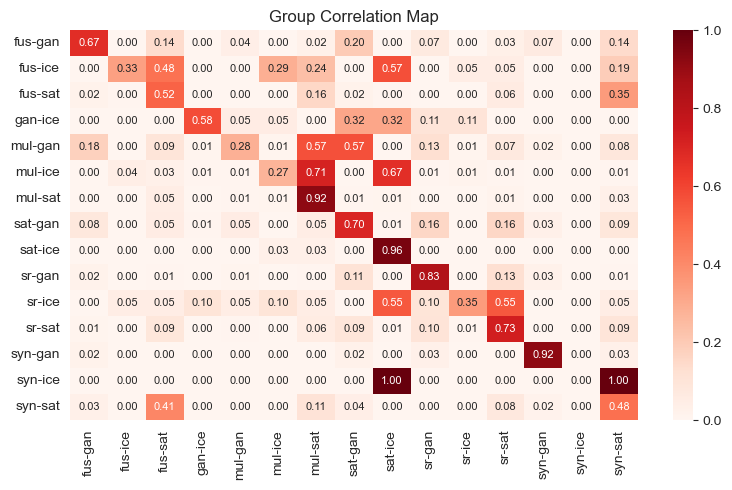

# literature_correlation
Tool to consolidate and identify correlation in literature searches

## Overview

The intention of this tool is to perform literature search across various catalogues, and consolidate results in a de-duplicated list.

The tool performs a correlation analysis between different search terms.

It is WiP 🚧  and requires manual steps.

## Steps

1. Define search strategy in `SearchTable.xlsx` and export as csv
2. Perform manual searches and save results
3. Adjust `LitResearch.ipynb` as needed
4. Run `LitResearch.ipynb`
5. Review Correlation Analysis
6. Find consolidated results in `consolidated_results.csv`

### 1. Define search strategy

- Each search consists of a combination of two search terms (tuples)
- Each search can be performed across one or multiple source catalogues
- Each search requires a unique ID
- Each search is assigned to exactly one group (groups are e.g. synonyms of the same term)

Populate the Excel as follows:

- `ID`: Unique ID of the search
- `source_<name>`: one column for each source catalogue;
additional columns can be added as needed;
`TRUE` if the respective search shall be performed in that catalog, `FALSE` otherwise
- `Term1` and `Term2`: the respective search term tuple
- `Group`: Group assignment of the search
- `count_<name>`: per each catalogue, the number of expected search results (if known, e.g. for manual searches;
this is only a countercheck/quality criterion)
- `YearFrom`: start year of the search
- `URL_<name>`: Excel formula, URL leading to the search results online; this is for user convenience only

Save the file as csv file.

### 2. Perform manual searches

For all searches, which do not offer a search API (e.g. Scopus, IEEE Xplore), perform the search manually and export the search results to csv.
Create a subfolder named exactly as the catalogue name, and save the csv according to the respective search ID, e.g.: `/Scopus/4.csv`.

### 3. Adjust `LitResearch.ipynb`

The following can be adjusted without changing the code:

- Target Columns
- Mapping of search result columns to Target Columns
- Adding API calls for further sources (currently, only arXiv API is implemented)

### 4. Run `LitResearch.ipynb`

### 5. Review Correlation analysis

The correlation analysis shows:

- off-diagonal values: per each row, how many of the search results have also been found in another group
- on-diagonal values: how many of the search results of the row have exclusively been found in the respective group

### 6. Review consolidated result list
